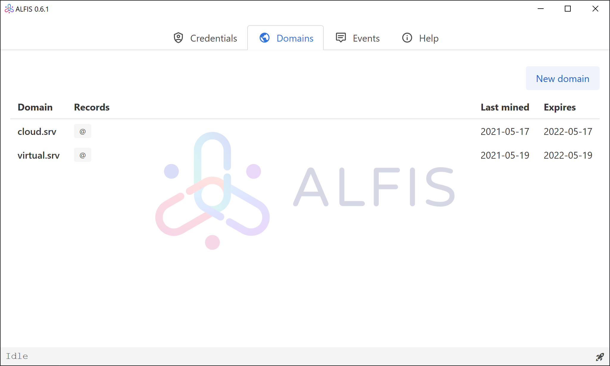

#  Alfis


Alternative Free Identity System

This project represents a minimal blockchain without cryptocurrency, capable of sustaining any number of domain names in a bunch of original alternative zones.
Not so clear? Hold on.

## This software provides:
- Very small and [peer-to-peer](https://en.wikipedia.org/wiki/Peer-to-peer) synchronized database of domain names.
The consistency of this database is based on [blockchain](https://en.wikipedia.org/wiki/Blockchain) technology, that prevents retroactive changing of data, and has strict cryptographical consensus.
- DNS server with cache, like you have in your Internet-router. It resolves the domains from database and forwards all regular DNS-requests to some other resolver - your router, Google DNS, Cloudflare DNS, or [AdGuard DNS](https://dns.adguard.com/) (if you want to block ads and trackers).
- Other systems need you to organize and run several DNS-servers to resolve their domains and regular domains, we have both in one.
Moreover, ALFIS can forward requests of regular domains to [DNS-over-HTTPS](https://en.wikipedia.org/wiki/DNS_over_HTTPS) server. The security and privacy is right here.
- Convenient graphical user interface to create domains in this alternative domain system. If you want just to use it like a DNS-server you can run it with `-n` flag or just build/download the variant without GUI.





## How it works?
Every node connects to its siblings and synchronizes the domain database.
This DB consists of cryptographically bound blocks, that contain encrypted domain names, contacts, and some info, if you wish.
There are 10 domain zones available to get domain in:
`.anon`, `.btn`, `.conf`, `.index`, `.merch`, `.mirror`, `.mob`, `.screen`, `.srv`, `.ygg`.
But, `.anon` and `.ygg` are bound to have IP-addresses from Yggdrasil Network only.

## Building and running

### On every OS
You can download and run already built binaries from [releases](https://github.com/Revertron/Alfis/releases), or you can build project yourself.

You can build Alfis by issuing `cargo build --release` and `cargo run --release` commands in a directory of cloned repository.

If you want to build a version without GUI and without DoH:
`cargo build --release --no-default-features`
And this for build without GUI, but with DoH:
`cargo build --release --no-default-features --features="doh"`

###  On Windows
You don't need any additional steps to build Alfis, just stick to the MSVC version of Rust.

If you see an error about missing `VCRUNTIME140.dll` when running alfis you will need to install [VC Redistributable](https://www.microsoft.com/en-us/download/details.aspx?id=52685) from Microsoft.

If you want to use modern browser engine from Edge instead of old from IE, you need to build with this command: `cargo build --release --features "edge"` (or use corresponding build from [releases](https://github.com/Revertron/Alfis/releases)).

###  On Windows (MINGW64)
If you'd rather use Gnu version of Rust you can build Alfis by these steps:
```
pacman -S git mingw64/mingw-w64-x86_64-rust mingw64/mingw-w64-x86_64-cargo-c
git clone https://github.com/Revertron/Alfis.git
cd Alfis
cargo build
```

###  On Linux
If you are building on Linux you must ensure that you have `libwebkitgtk` library installed.
You can do it by issuing this command: `sudo apt install libwebkit2gtk-4.0-dev` (on Debian/Ubuntu and derivatives).

####  On Arch Linux

Install from available [AUR package](https://aur.archlinux.org/packages/alfis) created by [@pztrn](https://github.com/pztrn):

```sh
yay -S alfis
```

####   On Gentoo Linux

Available in [dm9pZCAq overlay](https://github.com/gentoo-mirror/dm9pZCAq)
```sh
eselect repository enable dm9pZCAq
emerge --sync dm9pZCAq
emerge net-dns/alfis
```

###  On Nix/NixOS
`nix-shell` in this repo and then run `cargo build --release` and `cargo install` after you have entered the shell.

## Installation

### Debian/Ubuntu (only blockchain DNS, without GUI)
If you want to just use ALFIS as a DNS daemon and resolve domains in blockchain, as well as clearnet domains.
You just need to install `alfis` service from repo and change your resolver in `/etc/resolv.conf`.
Beware of NetworkManager, it can change your resolvers at will.

1. Download repository public key and add it to your APT
```
gpg --fetch-keys https://deb.revertron.com/key.txt
gpg --export F244E16645D86D62 | sudo tee /usr/local/apt-keys/alfis.gpg > /dev/null
```
2. Add repository path to sources list
```
echo 'deb [signed-by=/usr/local/apt-keys/alfis.gpg] https://deb.revertron.com/ debian alfis' | sudo tee /etc/apt/sources.list.d/alfis.list
```
3. Update packages and install ALFIS
```
sudo apt update && sudo apt install alfis
```
4. Enable and start the service
```
systemctl enable --now alfis
```
After that configuration is in file `/etc/alfis.conf` and data is saved to `/var/lib/alfis`.
If you have some DNS server bound to port 53, it will not properly start. Deal with it on your own.

### openSUSE (without GUI)
1. Add repo:
```
zypper ar --refresh obs://home:Werwolf2517 home:Werwolf2517
```
2. Refresh repos cache
```
zypper --gpg-auto-import-keys refresh
```
3. Install package
```
zypper install -y Alfis
```
4. Run daemon
```
systemctl enable --now alfis
```
### Docker
If you want to run ALFIS in docker container, you can do this by running:
```shell
docker run --rm --name alfis -p 53:53/tcp -p 53:53/udp cofob/alfis
```

### GUI version Windows/Linux/macOS (if you want to create and change domains)
If you want to create and manage your own domains on blockchain, you will need a version with GUI.
You can download it from [releases](https://github.com/Revertron/Alfis/releases) section, choose appropriate OS and architecture version.
It needs to be without `nogui` suffix.

Just unzip that archive in some directory and run `alfis` (or `alfis.exe`) binary.
By default, it searches for config file, named `alfis.toml` in current working directory, and creates/changes `blockchain.db` file in the same directory.
If you want it to load config from another file you can command it so: `alfis -c /etc/alfis.conf`.

## Roadmap
1. Stabilize blockchain functions (domain transfer, info & contacts in UI), bug hunting and fixing.
2. Change DNS server/proxy to own resource saving implementation (using trust-dns-proto for RR parsing).
3. P2P traffic encryption (ECDH). ✅
4. Web-GUI to manage you node from browser.

## Remarkable contributions
* [@umasterov](https://github.com/umasterov) contributed fantastic logo for this project.
