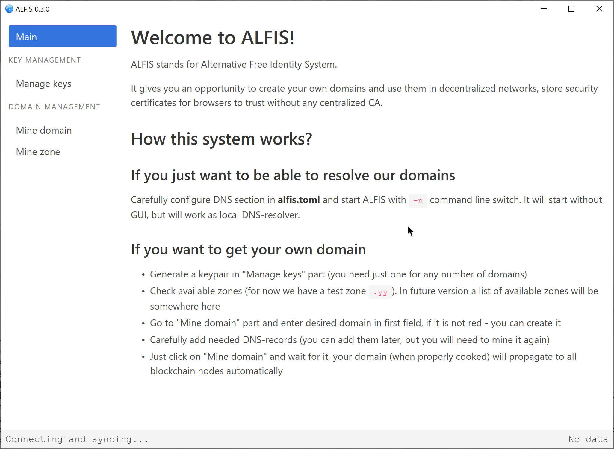
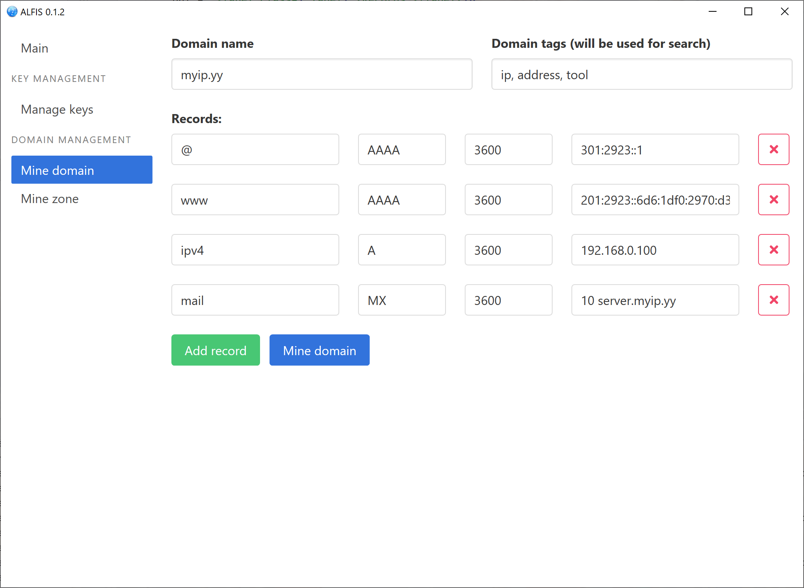

# Alfis


Alternative Free Identity System

This project represents a minimal blockchain with no coin, capable of sustaining any number of domain name zones and domains.






## Building

### On every OS
You can build Alfis by issuing `cargo build` and `cargo run` commands in a directory of cloned repository.
If you want to build release version you need to do `cargo build --release` as usual.

### On Windows
You don't need any additional steps to build Alfis, just stick to the MSVC version of Rust.

### On Windows (MINGW64)
If you'd rather use Gnu version of Rust you can build Alfis by these steps:
```
pacman -S git mingw64/mingw-w64-x86_64-rust mingw64/mingw-w64-x86_64-cargo-c
git clone https://github.com/Revertron/Alfis.git
cd Alfis
cargo build
```

### On Linux
If you are building on Linux you must ensure that you have `libwebkitgtk` library installed.
You can do it by issuing this command: `sudo apt install libwebkit2gtk-4.0-dev` (on Debian/Ubuntu and derivatives).
