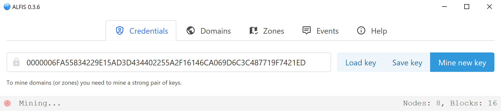
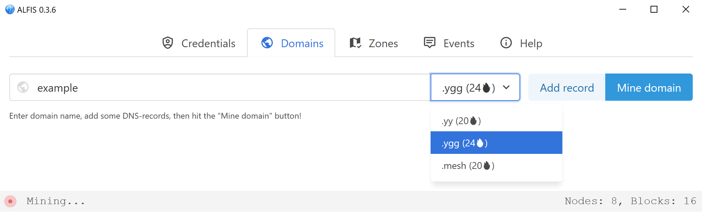

#  Alfis


Alternative Free Identity System

This project represents a minimal blockchain without cryptocurrency, capable of sustaining any number of domain name zones and domains.






## Building and running

### On every OS
You can download and run already built binaries from [releases](https://github.com/Revertron/Alfis/releases), or you can build project yourself.

You can build Alfis by issuing `cargo build` and `cargo run` commands in a directory of cloned repository.
If you want to build release version you need to do `cargo build --release` as usual.

###  On Windows
You don't need any additional steps to build Alfis, just stick to the MSVC version of Rust.

If you see an error about missing `VCRUNTIME140.dll` when running alfis you will need to install [VC Redistributable](https://www.microsoft.com/en-us/download/details.aspx?id=52685) from Microsoft.

If you want to use modern browser engine from Edge instead of old from IE, you need to build with this command: `cargo build --release --features "edge"` (or use corresponding build from [releases](https://github.com/Revertron/Alfis/releases)).

###  On Windows (MINGW64)
If you'd rather use Gnu version of Rust you can build Alfis by these steps:
```
pacman -S git mingw64/mingw-w64-x86_64-rust mingw64/mingw-w64-x86_64-cargo-c
git clone https://github.com/Revertron/Alfis.git
cd Alfis
cargo build
```

###  On Linux
If you are building on Linux you must ensure that you have `libwebkitgtk` library installed.
You can do it by issuing this command: `sudo apt install libwebkit2gtk-4.0-dev` (on Debian/Ubuntu and derivatives).

####  On Arch Linux

Create and install package with this commands:

```sh
# make package
git clone https://github.com/Revertron/Alfis.git
cd Alfis/contrib
makepkg

# install package (from root)
pacman -U alfis-<version>-1-x86_64.pkg.tar.xz
```
